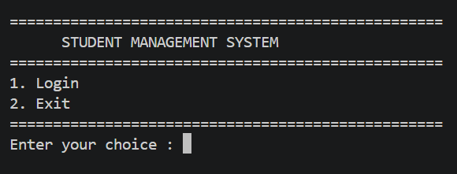
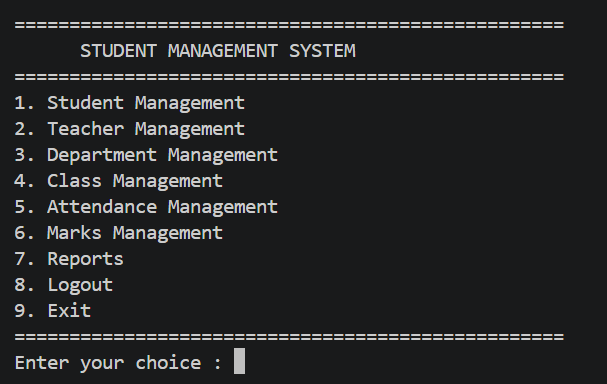
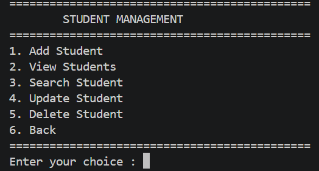
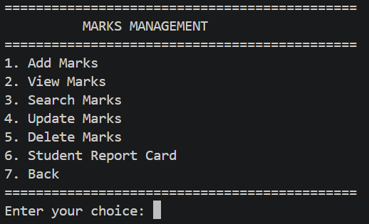
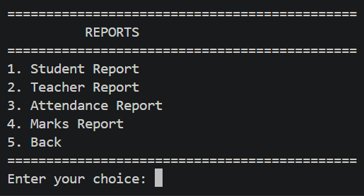

# Student Management System

A console-based Student Management System built with Python and MySQL. The application provides modular management of students, teachers, departments, classes, attendance, marks, and reports.

## Features

### Authentication
- Secure login system
- Role information for users
- Password hashing using bcrypt
- Logout functionality

### Student Management
- Add student
- View students
- Search student
- Update student
- Delete student

### Teacher Management
- Add teacher
- View teachers
- Search teacher
- Update teacher
- Delete teacher

### Department Management
- Add department
- View departments
- Search department
- Update department
- Delete department

### Class Management
- Add class
- View classes
- Search class
- Update class
- Delete class

### Attendance Management
- Mark attendance
- View attendance records
- Search student attendance
- Generate attendance reports
- Calculate attendance percentage

### Marks Management
- Add marks
- View marks
- Search student marks
- Update marks
- Delete marks
- Generate student report cards
- Calculate average and percentage
- Grade calculation

### Reports
- Student report
- Teacher report
- Attendance report
- Marks report

---

## Tech Stack

| Technology | Purpose |
|---|---|
| Python | Application development |
| MySQL | Database management |
| bcrypt | Password hashing |
| mysql-connector-python | MySQL connectivity |
| python-dotenv | Environment configuration |
| Git | Version control |
| GitHub | Source code management |

---

## Project Structure

```text
student-management-system/
│
├── config/
│   └── config.py
│
├── services/
│   ├── attendance_service.py
│   ├── auth_service.py
│   ├── class_service.py
│   ├── database.py
│   ├── department_service.py
│   ├── marks_service.py
│   ├── menu.py
│   ├── report_service.py
│   ├── student_service.py
│   └── teacher_service.py
│
├── sql/
│   ├── schema.sql
│   └── sample_data.sql
│
├── utils/
│   ├── logger.py
│   └── validation.py
│
├── .env.example
├── .gitignore
├── main.py
├── README.md
└── requirements.txt

## Screenshots

### Login



### Dashboard



### Student Management



### Marks Management



### Reports

